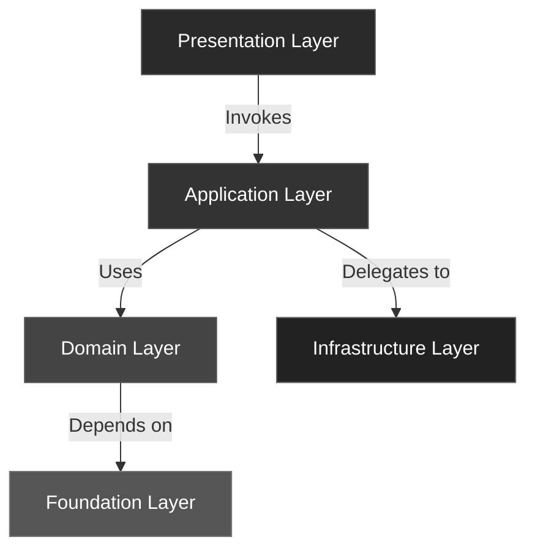

# 🧩 ForgingBlocks

Composable **abstractions and interfaces** for writing clean, testable, and maintainable Python systems.

> Not a framework — a **toolkit** for forging your own architectural blocks.

---

## 🌱 What Is ForgingBlocks?

ForgingBlocks provides **foundations** — small, composable contracts that help you design software with **clarity**, **intent**, and **resilience**.

It doesn’t enforce a specific framework or runtime.
Instead, it gives you the *language* to express architectural ideas such as:

- Clean Architecture  
- Hexagonal / Ports & Adapters  
- Domain-Driven Design (DDD)  
- CQRS and Event-Driven Systems  

You decide the style.  
ForgingBlocks ensures the structure stays clear and consistent.

---

## 🧠 Core Concepts

| Concept | Purpose |
|----------|----------|
| **Result / Ok / Err** | Represent success or failure explicitly |
| **Port / Inbound / Outbound** | Define clear communication boundaries |
| **Entity / ValueObject / AggregateRoot** | Model domain consistency and behavior |
| **Event / EventBus / CommandHandler** | Express orchestration through messaging |
| **Repository / UnitOfWork** | Abstract persistence and coordination |

---

## 🏗️ Architectural Layers



Each layer is a **boundary of responsibility**.  
The toolkit’s abstractions ensure dependencies flow inward — never outward.

---

## 🚀 Getting Started

Install using Poetry or pip:

```bash
poetry add forging-blocks
# or
pip install forging-blocks
```

Quick example:

```python
from forging_blocks.foundation import Result, Ok, Err

def divide(a: int, b: int) -> Result[int, str]:
    if b == 0:
        return Err("division by zero")
    return Ok(a // b)
```

---

## 📚 Learn More

- [Getting Started](guide/getting-started.md)
- [Architecture Overview](guide/architecture.md)
- [Packages & Layers](guide/packages_and_layers.md)
- [Reference Index](reference/index.md)
- [Release Guide](guide/release_guide.md)

---

## 🧭 Why It Matters

Most systems fail not because of missing features, but due to **tight coupling** and **unclear boundaries**.

ForgingBlocks helps you forge software that **teaches architecture by design** —  
**clear**, **testable**, and **maintainable**, block by block.
